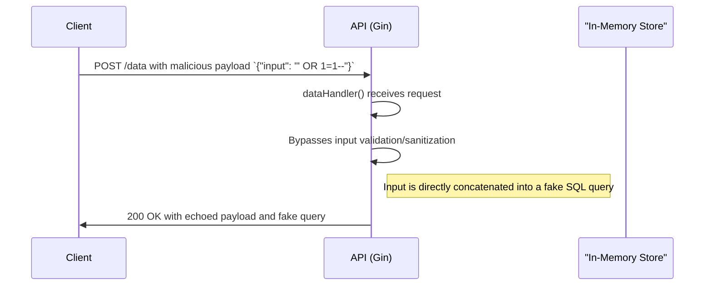

# Br0K3nAPI Architectural Document

## 1. Overview

This document provides an architectural overview of the `Br0K3nAPI` application. It is an intentionally vulnerable REST API written in Go using the Gin web framework. Its primary purpose is to serve as a target for penetration testing tools and to educate developers on common API security flaws. The application is designed as a monolithic service that is simple to run and test.

**Core Technologies:**
*   **Language:** Go
*   **Framework:** Gin (`github.com/gin-gonic/gin`)
*   **API Documentation:** Swagger (`github.com/swaggo/swag`)

## 2. Application Architecture

`Br0K3nAPI` follows a simple, single-file monolithic architecture. All application logic, including route definitions, handlers, and data storage, is contained within the `main.go` file.

*   **Entry Point:** The application logic resides entirely in `main.go`, which sets up the Gin router, defines middleware, and registers all API endpoints.
*   **Data Storage:** The application uses a simple in-memory map (`var users = map[string]User{}`) to store user data. This data is not persisted and will be lost upon application restart. Passwords are intentionally stored in plaintext.
*   **Configuration:** Configuration is minimal and hardcoded, such as the JWT secret key and the server port (`:8888`).

## 3. API Endpoints

The API exposes several endpoints, each designed to demonstrate one or more security vulnerabilities.

| Method | Path              | Description                                  | Associated Vulnerabilities                                       |
|--------|-------------------|----------------------------------------------|------------------------------------------------------------------|
| POST   | `/register`       | Register a new user                          | Weak Password Policy, Verbose Errors                             |
| POST   | `/login`          | Authenticate and receive a JWT               | Weak JWT Secret, Plaintext Password Comparison                   |
| GET    | `/profile/:userID`| Get a user's profile                         | Insecure Direct Object Reference (IDOR)                          |
| POST   | `/data`           | Submit and echo data                         | Cross-Site Scripting (XSS), SQL Injection (simulated)            |
| GET    | `/admin/secret`   | Access an admin-only resource                | Broken Access Control                                            |
| GET    | `/leak/env`       | Retrieve all server environment variables    | Sensitive Data Exposure                                          |
| GET    | `/redirect`       | Redirect to a user-provided URL              | Open Redirect                                                    |
| POST   | `/upload`         | Upload a file                                | Insecure File Upload (no type/size validation)                   |
| GET    | `/readfile`       | Read a file from the server's filesystem     | Path Traversal                                                   |
| GET    | `/error`          | Trigger and display a server-side error      | Verbose Error Messages, Information Leakage                      |
| GET    | `/ping`           | Health check endpoint                        | None                                                             |
| GET    | `/swagger/*any`   | Serves the Swagger UI for API documentation  | Information Leakage (exposes all endpoints and structures)       |

## 4. Authentication & Authorization

Authentication is managed via JSON Web Tokens (JWT), but the implementation is intentionally flawed.

*   **Weak JWT Secret:** The secret used to sign JWTs is a weak, hardcoded string (`"secret"`), making it susceptible to brute-force attacks.
*   **No Role-Based Access Control (RBAC):** Authorization logic is minimal. The `/admin/secret` endpoint only checks if the `username` claim in the JWT is "admin", without verifying roles or permissions. Any user can create an "admin" account and gain access.
*   **Token Expiration:** Tokens have a short expiration time (1 hour), which is a good practice, but it does not mitigate the other fundamental flaws.

## 5. Detailed Vulnerability Analysis (with Code Snippets)

This section details the specific vulnerabilities implemented in the codebase.

### 5.1 Insecure Direct Object Reference (IDOR)
The `profileHandler` allows any authenticated user to retrieve the profile of *any* other user by simply providing their username in the URL path. There is no check to ensure the requester is authorized to view the requested profile.

```go
// main.go:116
func profileHandler(c *gin.Context) {
	// ... (token validation)
	userID := c.Param("userID")
	user, exists := users[userID] // No authorization check here
	if !exists {
		c.JSON(http.StatusNotFound, gin.H{"error": "User not found"})
		return
	}
	c.JSON(http.StatusOK, user)
}
```

### 5.2 Broken Access Control
The `adminSecretHandler` only validates that the `username` claim in the JWT is "admin". It does not rely on a robust role or permission system.

```go
// main.go:182
func adminSecretHandler(c *gin.Context) {
    // ... (token validation)
	claims, ok := token.Claims.(jwt.MapClaims)
	// ...
	username, _ := claims["username"].(string)
	if strings.ToLower(username) != "admin" { // Simple string comparison for auth
		c.JSON(http.StatusUnauthorized, gin.H{"error": "You are not admin"})
		return
	}
	c.JSON(http.StatusOK, gin.H{"secret": "The admin flag is: FLAG-ADMIN-1337"})
}
```

### 5.3 SQL Injection (Simulated) & XSS
The `dataHandler` takes user input and directly concatenates it into a simulated SQL query string. It also echoes the input back in the response, making it vulnerable to both SQLi and Reflected XSS.

```go
// main.go:148
func dataHandler(c *gin.Context) {
    // ... (token validation)
	var req map[string]string
	if err := c.ShouldBindJSON(&req); err != nil {
		// ...
	}
	if val, ok := req["input"]; ok {
		// User input 'val' is directly concatenated into the query
		fakeQuery := "SELECT * FROM data WHERE input = '" + val + "'"
		// 'val' is echoed back without sanitization, allowing XSS
		c.JSON(http.StatusOK, gin.H{"echo": val, "query": fakeQuery})
		return
	}
	// ...
}
```

### 5.4 Path Traversal
The `readfileHandler` reads a file from the local filesystem based on the `path` query parameter without any sanitization, allowing an attacker to read arbitrary files.

```go
// main.go:286
func readfileHandler(c *gin.Context) {
	path := c.Query("path") // No sanitization of the path
	data, err := ioutil.ReadFile(path)
	if err != nil {
		c.JSON(http.StatusBadRequest, gin.H{"error": err.Error()})
		return
	}
	c.String(http.StatusOK, string(data))
}
```

### 5.5 Insecure File Upload
The `uploadHandler` accepts file uploads without validating the file type, size, or content. It writes the file directly to the `/tmp/` directory with its original filename, which could lead to remote code execution or denial of service.

```go
// main.go:247
func uploadHandler(c *gin.Context) {
	file, header, err := c.Request.FormFile("file") // No validation on file type or size
	// ...
	bytes, err := ioutil.ReadAll(file)
	// ...
	filename := "/tmp/" + header.Filename // Potential for path traversal in filename
	ioutil.WriteFile(filename, bytes, 0644)
	c.JSON(http.StatusOK, gin.H{"message": "File uploaded", "filename": filename, "size": len(bytes)})
}
```

### 5.6 Weak JWT Secret & Plaintext Passwords
The JWT secret is hardcoded, and user passwords are stored and compared in plaintext.

```go
// main.go:29
var jwtSecret = []byte("secret") // Weak, hardcoded secret

// main.go:33
type User struct {
	Username string `json:"username"`
	Password string `json:"password"` // Stored in plaintext
}

// main.go:90
if !exists || user.Password != req.Password { // Plaintext comparison
    c.JSON(http.StatusUnauthorized, gin.H{"error": "Invalid username or password"})
    return
}
```

## 6. Data Flow & Security Flaws

The following diagram illustrates the flawed data flow for a typical request to a vulnerable endpoint, such as `/data`.



## 7. Dependencies & Risks

The `go.mod` file lists the project's dependencies. A key risk is the use of `github.com/dgrijalva/jwt-go`, which is **deprecated and unmaintained**. This library has known security issues and should not be used in production applications. Modern alternatives like `github.com/golang-jwt/jwt` should be used instead.

## 8. Security Posture Summary

The `Br0K3nAPI` application is, by design, critically insecure. It successfully demonstrates a wide range of common API vulnerabilities from the OWASP API Security Top 10 list. Its architecture is overly simplistic and lacks fundamental security controls such as input validation, proper authentication/authorization, and secure configuration. It serves its purpose well as an educational tool for identifying and understanding API security risks.